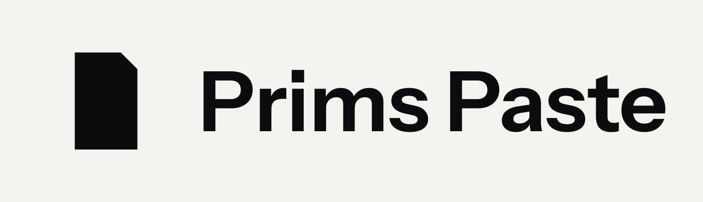

# prims-paste-desktop

<p align="center">
  
</p>

GitHub: https://github.com/primfoundation/prims-paste-desktop

App: `~/Applications/Primboard.app`  
Display name: **Primboard**  
Identifier: `sh.prims.paste` (keep this; TCC and the executable stay `PrimsPaste`)

Encrypted sticky board for this Mac. Touch ID to open. Not SafePaste; no CLI broker, no 24h TTL, no shared store.

```bash
./scripts/build.sh
```

Builds a separate candidate signed as
`Developer ID Application: Eidos AGI LLC (Y6CQ4SWPWM)` after checking usable signing
access. It does **not** replace the installed app, update the CLI link, or open the
notebook. See [MAC-RELEASE.md](MAC-RELEASE.md) for notarization, the local-agent work
order, protected installation, and the remaining release gates.

Store: `~/.prims-paste/notebook/` (AES-GCM, key in login keychain).  
Convert: Docket via `docket-prim task-create` into `~/.prims-paste/docket/`; Paseo via `paseo run`.

CLI (same store as the app):

```bash
prims-paste help
prims-paste open
prims-paste tabs
prims-paste add --tab bugs --title "…" --body "…"
prims-paste list --tab bugs
prims-paste convert <id> docket
prims-paste bugs file
prims-paste bugs tasks
```
